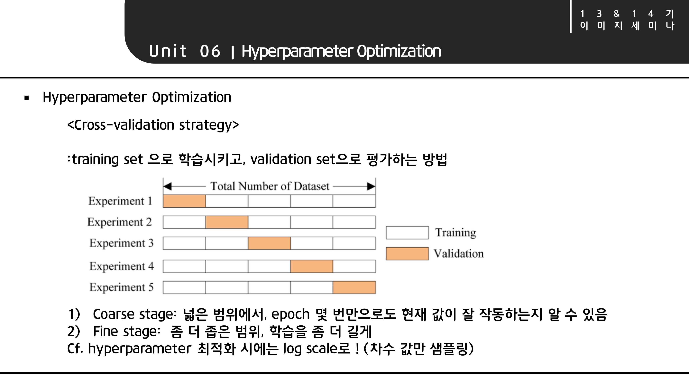

# \[Lecture 6\] Training Neural Networks I

### CS231n 6강 리뷰

6강에서는 Neural Networks를 학습시키는 방법들을 알아본다. 큰 흐름은 강의의 흐름을 그대로 따라간다. 

## Unit 1. Activation Functions

### 1.1. Activation Function

Activation function\(활성화 함수\) 신경망의 출력을 결정하는 식이다. 그림과 같이 신경망에서는 뉴런에 연산 값을 계속 전달해주는 방식으로 가중치를 훈련하고 예측을 진행한다. 이 때 각각의 활성화 함수는 네트워크의 각 뉴런에 연결되어 있고, 각 뉴런의 입력이 모델의 예측과 관련되어 있는지의 여부에 따라 활성화된다. 활성화 함수는 훈련과정이나 역전파 과정에서 계산량이 많으므로 효율성이 중요하다.

activation function의 종류를 간략하게 살펴보자. 

먼저 binary step function은 다중 분류 문제에서 다중 출력을 할 수 없다. 또한 linear activation function\(선형활성화 함수\) 함수는 step function 과 달리 다중 출력이 가능하다. 하지만 몇 가지 문제가 있다.

**1. backpropagation 사용이 불가능**

역전파는 함수를 미분하여 사용하는 과정인데 선형함 수의 미분은 상수이기 때문에 입력값과 무관한 결과가 나오기 때문이다.

**2. hidden layer를 무시하고 얻을 수 있는 정보를 제한** 

활성화 함수를 여러 층을 쓰면서 필요한 정보를 얻어야 하는데, 선형함수를 여러 번 사용하는 것은 마지막에 선형함수 한 번 사용하는 정도밖에 안된다. 따라서 hidden layer를 여러 번 사용하는게 의미가 없게 된다.

이러한 단점들 때문에 우리는 보통 비선형 함수를 사용한다. Non-linear activation function을 통해 입출력간의 복잡한 관계를 만들어서 입력에서 필요한 정보를 얻는 것이다. 이는 앞서 본 linear activation function과 달리 backpropagation이 가능하고, hidden layer를 통해 더 많은 핵심 정보들을 얻는 게 가능해지기 때문에 굉장히 유용하다.


**강의에서 소개하는 Activation Function**

1. sigmoid
2. tanh
3. ReLU
4. Leaky ReLU
5. ELU
6. Maxout 


### 1.2. Sigmoid

sigmoid 함수는 입력값이 커질수록 1에, 작을수록 0에 수렴하는 형태이다. 출력값의 범위가 \(0,1\)이므로 정규화 관점에서는 gradient 가 발산해버리는 문제를 방지한다. 

하지만 몇가지 문제가 있다. 

**1.gradient vanishing \(기울기 소실\)** 

우측 그림처럼 forward와 back을 반복하며 기울기를 구한다고 하자. 입력값이 -10이나 10인 경우 gradient가 소멸된다. 미분함수에 절대값이 큰 값이 input으로 들어가면 0 이 나 1로 수렴하고, 그 기울기는 0이 되기 때문에 0이 곱해지면 gradient가 사라진다. 결국 역전파는 계속 진행되는데 아래층에는 아무것도 전달이 되지 않는 문제가 생긴다.

**2.출력의 중심이 0이 아님** 

우측 하단 그림처럼 경사하강법이 이루어질 때, 직선으로 가지 못하고 지그재그로 수렴한다. 파란선을 따라 쭉 움직이지 않으므로 굉장히 비효율적이다.

**3.지수함수 계산으로 계산 비용이 큼**

\*\*\*\*

### 1.3. tanh

tanh 함수는 들어오는 입력값에 대해 \[-1,1\] 사이의 값을 출력하여 zero center가 된다. 하지만 sigmoid 와 같은 이유로 vanishing gradient 문제가 여전히 존재한다.

### 1.4. ReLU

ReLU를 가장 많이 사용하고, 강의에서도 추천하고 있다.

음수 부분은 0, 양수 부분은 linear한 형태이다. 앞서 계속 문제가 되었던 saturation이 ReLU의 \(+\)영역에서는 일어나지 않아 기울기의 절반을 살릴 수 있다.

음수 부분을 일부 정보에 대한 무시와 수용이 일어난다고 볼 수 있고, linear하기 때문에 계산이 매우 효율적이다. 그래서 매우 빠르게 수렴한다.

하지만 zero-center 문제가 다시 발생하고, 또 입력값이 음수인 부분은 아예 학습을 하지 못한다.


**Dead ReLU**

 역전파 과정에서 ReLU 미분함수의 형태때문에 음수에서 기울기가 0이 되고, 0에서는 미분이 불가능하기 때문에 활성화가 되지 않는 현상


### 1.5. Leaky ReLU

### 1.6. ELU

### 1.7. Maxout

Non-linear activation function에서 다룬 내용을 정리하자면,


1. **ReLU를 사용하자. 단 learning rate를 잘 설정해야 한다.**
2.  **Leaky ReLU / Maxout / ELU를 시도해본다.**
3. **tanh에서는 좋은 성능을 기대하지 말자.**
4. **sigmoid는 쓰지 말자.**


## Unit 2. Data Preprocessing

앞서 언급한 문제들은 데이터 전처리를 통해 해결할 수 있다. zero-center가 아닌 문제를 데이터를 중앙으로 모으는 전처리로 어느 정도 해결할 수 있다. 하지만 레이어가 깊어질수록 zero-center 문제가 계속 나타나기 때문에 일반적으로 이 과정만으로 완벽하게 보정하기는 힘들다.

그래서 normalization 정규화 과정은 같은 영역 내에 데이터들이 위치하도록 만들어서  기여하는 duddgid의 정도를 동일하게 만들어주는 역할을 한다. 하지만 이미지에서는 이미 0~255와 같이 정해져 있기 때문에 쓰지는 않는다. 또한 이미지에서는 pca나 whitening도 굳이 사용하지 않고, 오직 center만 전처리를 한다.

이미지분야의 center 전처리 과정은 다음과 같이 진행한다\(예시\)

1. 알렉스넷은 이미지의 평균을 뺌

2. VGGnet은 채널의 평균값을 뺌

3. ResNet은 평균값을 빼고 분산을 나눔

## Unit 3. Weight Initialization

### 3.1. Weight Initialization?

relu에서 weight를 처음에 잘못 초기화시키면 처음부터 gradient가 죽어버리는 Dead relu 현상이 발생한다. 그래서 사실상 초기 가중치를 잘못 설정하면 기울기 소실 문제가 발생한다. 가중치 초기화에서 초기값을 모두 0으로 설정하는 경우 모든 뉴런에서 같은 일이 일어나 동일한 output을 내보내게 되고, 역전파를 할 때에도 모두 같은 gradient를 갖게 된다. 결국은 학습이 제대로 되지 않아 hidden layer를 여러 개 합한 의미가 사라진다. 즉, 뉴런의 비대칭성을 해치게 된다. 

따라서 어떻게 초기화를 해야 할까 하는 고민에서 weight initialization이 시작된다.

### 3.2. 임의의 작은 수로 초기화

먼저 임의의 작은 수로 초기화시키는 아이디어이다. 이처럼 평균이 0이고 표준편차가 0.01인 가우시안 분포에 대해 무작위의 숫자로 초기화시키는데, 이 방법은 네트워크가 깊어지면 문제가 발생한다.

### 3.3. Xavier Initialization

### 3.4. HE Initialization

## Unit 4. Batch Normalization

## Unit 5. Babysitting the Learning Process

## Unit 6. Hyperparameter Optimization

hyperparameter tuning은 다음 강의에서 중점적으로 다루고 있기 때문에 크게 다루지는 않았다. 

이번 강의에서 살펴 본 내용은 다음처럼 정리할 수 있다.


Summary

1. Activation function은 ReLU를 사용하자
2. Data Processing - 이미지에서는 subtract mean
3. weight initialization을 사용하자
4. batch normalization을 사용하자
5. hyperparameter optimization 
   * random sample hyperparams
   * in log space when appropriate 


## References

* **\(💛\) 투빅스 13기 최혜빈님 12&13기 이미지 세미나 강의자료 \(💛\)**
* Stanford cs231n 6강
  * Slide [http://cs231n.stanford.edu/syllabus.html](http://cs231n.stanford.edu/syllabus.html)
  * Video [https://www.youtube.com/watch?v=wEoyxE0GP2M](https://www.youtube.com/watch?v=wEoyxE0GP2M)
* 12&13기 정규세션 12기 이승현님 NN심화 강의자료
* Activation function
* weight initialization [https://nittaku.tistory.com/269?category=742607](https://nittaku.tistory.com/269?category=742607)
* Batch Normalization
  * 논문 [https://arxiv.org/abs/1502.03167](https://arxiv.org/abs/1502.03167)
  * CNN BN 
    * [https://m.blog.naver.com/laonple/220811172205](https://m.blog.naver.com/laonple/220811172205) 
    * [https://wwiiiii.tistory.com/entry/Batch-Normalization](https://wwiiiii.tistory.com/entry/Batch)
    * [https://www.youtube.com/watch?v=TDx8iZHwFtM](https://www.youtube.com/watch?v=TDx8iZHwFtM)

