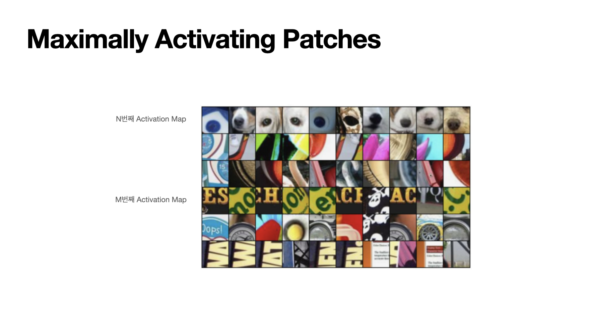

# \[Lecture 12\] Visualizing and Understanding

## CS231n 12강 Review

12강 Visualizing and Understanding을 주제로 진행된 강의입니다.

CNN은 image를 대상으로 복잡한 기능을 수행하여 문제를 해결해주는 모델로, 앞서 11강 강의를 통해 배운 것처럼  Semantic Segmentation, Classification, Object Detection 등 여러가지 vision task들이 가능합니다.

CNN의 다양한 아키텍쳐도 배우고 신기한 여러가지 task들도 배웠지만 실제로 CNN이 어떻게 이런 작동을 하는지 구체적으로 배운적은 없습니다.

하지만 이번 강의에서는 CNN의 작동과정을 시각화하여 이해하는 과정을 볼 수 있습니다.

cnn의 처음, 중간, 끝 모든 과정을 알아보도록 하겠습니다.

Alexnet을 예시로 첫번째 Conv Layer를 살펴보겠습니다.

Alexnet의 각 convolution filter는 3 by 11 by 11의 형태를 취하고 있습니다. 필터는 모든 영역을 돌아다니면서 내적을 수행하는 역할을 갖고있고, 이렇게 필터의 가중치와 내적한 결과가 다음 그림이며 64개의 3 by 11 by 11 필터라고 보시면 됩니다.

여기서 이 필터를 시각화 하는 것으로 우리는 이 필터가 이미지에서 무엇을 찾는지 알 수 있는데요, 3 by 11 by 11에서 3이 각각 RGB로 색을 표현하면 11by11 크기의 색을 가진 필터 64개로 시각화 할 수 있습니다.

이 그림을 살펴보면 가장 먼저 흰색/ 검은색으로 구분된 엣지 성분들을 볼 수 있고, 보색 또한 확인할 수 있습니다. \(분홍색과 초록색 또는 주황색과 파란색의 조합이 보색입니다.\) 

인간의 시각체계가 주로 엣지를 기준으로 감지한다고 알려진 것처럼 CNN도 첫번째 레이어에서는 인간과 동일한 행동을 하는 것으로 예상할 수 있습니다.

특이하게도 ResNet이나 DenseNet등 어떤 모델/데이터로 학습하던첫 번째 레이어는 전부 다 이런 형식이라고 합니다.

이후 Layer들은 어떻게 시각화 할 수 있을까요?

앞서 보여드린 시각화 기법으로 중간에 있는 conv layer을 적용하는 것은 보고 해석하는 것에 어려움이 있습니다.

첫번째 layer에서 16 by 3 by 7 by 7 형태의 필터가 나왔다면 3개의 RGB값을 이용하여 색을 표현한 7by7크기의 필터를 16개로 표현할 수 있습니다.

이후 수차례 conv layer를 거치고 ReLu함수를 거쳐 2번째 layer에 오면 7by7크기의 필터가 16개가 되는데, 숫자가 3이 아닌 이상 색을 표현하는데 어려움이 있을 것입니다. 그럼에도 불구하고 시각화를 한다면 다음과 같이 7by7크기의 필터 16개 형태의 쌍 20개가 만들어질 것인데요, 이렇게 결과가 나오더라도 이 그림을 통해 얻을 수 있는 정보는 없습니다.

두번째 layer는 첫번째 layer의 출력과 연결되어있으므로 결과적으로 이 시각화 결과는 처음 input으로 넣은 이미지에 대한 정보가 아닌 두번째 layer에 영향을 주는 첫번째 layer에 대한 정보라고 할 수 있기 때문에 처음 넣은 이미지와의 연관성을 생각하기에는 어려움이 있습니다.

따라서 네트워크의 중간 레이어의 필터들이 무엇을 찾고있는지를 알아내려면 다른 방법이 필요한데요, 자세한 내용은 나중에 설명드리겠습니다.

cnn의 마지막, 1000개의 class로 분류하기 전에는 Fully Connected Layer가 있습니다.

alexnet의 예시로들면 4096-dim 특징벡터를 마지막에 입력받은 뒤 최종 class score를 출력하도록 되어있는데요, 이 부분을 시각화하여 cnn의 마지막 레이어를 이해할 수 있습니다.

첫번째로 Nearest Neighbor을 이용한 방법입니다.  
정말 많은 이미지로 CNN을 돌려서 각 이미지에서 나온 4096-dim 특징 벡터를 모두 저장힙니다. 이후 새로운 input image를 CNN에 넣으면 새로운 4096-dim 특징 벡터를 추출할 수 있는데요, 이 값을 이용하여 Nearest Neighbor를 계산하는 것입니다. 

예를들어 왼쪽 상단의 보라색 꽃 사진을 넣었다고 했을 때 먼저 이 보라색 꽃의 vector를 뽑습니다. 뽑은 vector값과 이미 저장되어있던 vector값들과의 거리를 계산하여 가까운 거리를 가진 vector의 실제 그림들이 오른쪽 열에 보여지고 있습니다. 

이 방법은 pixel space를 이용한 것이 아니기 때문에 두번째 그림에서의 코끼리를 보았을 때 왼쪽에 서있는 코끼리를 넣었음에도 오른쪽에 서있는 코끼리를 출력될 수 있게 된 것입니다.\(그렇기 때문에 픽셀 값의 차이가 큰 경우도 있다.\)

마지막 layer를 시각화 할 때 ‘차원 축소’를 중심으로 볼 수도 있습니다.

4096의 dimesion을 2만큼의 dimensions으로 차원축소를 해주는 PCA보다 더 강력한 방식으로 t-SNE가 소개되었는데요, 가장 왼쪽편의 이 사진이 t-SNE로 차원 축소하여 MNIST 데이터셋을 시각화한 모습입니다.

아시다시피 MNIST는 0부터 9까지의 숫자가 손글씨로 표현된 데이터로 28 by 28 크기의 Gray scale 이미지 입니다. 

여기서 t-SNE에 MNIST의 28x28-dim을 입력받아 2-dim으로 압축을 하고 시각화 한 모습인데, 잘 군집화가 된 모습을 볼 수 있습니다. 군집하나하나가 각 숫자를 의미하는 것입니다.

바로 오른쪽 예시도 살펴보자면 t-SNE로 차원을 축소한 뒤 시각화 한 모습인데요, 크기가 작아서 정확히 보이진 않겠지만 왼쪽 아래에 초록색을 띈 꽃들이 군집화 되어있고 오른편 하단에는 강아지들이 모여있는 등 군집화 되어있습니다.

지금부터는 다시 중간 layer 관찰해볼텐데요, 가중치가 아닌 Activation map을 시각화하여 볼 수 있습니다.

alexnet을 예시로들면 alexnet의 5번째 conv layer에서는 128x13x13의  feature map을 갖습니다. 따라서 13by13의 크기를 갖는 gray scale 이미지 128개로 시각화 해볼 수 있습니다.

다음 사진의 왼쪽 상단에 있는 사람 사진을 input으로 넣었을 때의 결과인데요, 결과를 보면 대부분은 noise이고 볼게 없지만 초록색 네모를 친 부분을 보았을 때 실제 사진에서 사람의 얼굴부분을 잘 형상화한 것을 볼 수 있습니다.

이 피쳐맵은 사람의 얼굴에 활성화되는 것이고 나머지 부분은 이 사진과같은 입력에 대해 활성화되지 않았다고 볼 수 있습니다.

Maximally Activating Patches는 ****어떤 이미지가 들어와야 각 뉴런들의 활성이 최대화되는지를 시각화해보는 방법입니다.

이 예시에서도 다시 한번 AlexNet의 conv5 layer를 사용하겠습니다. 전 슬라이드에서 말씀드린 것처럼 AlexNet의 conv5는 128 x 13 x 13 한 덩어리의 activation volume을 갖습니다.

이 13 by 13 크기를 가진 feature map 128개 중 하나를 선택하여 어떤 이미지일 때 가장 활성화 되는지를 보는 것입니다. \(강의에서는 17번째 채널을 예시로 들었다\)

이 사진은 특정 레이어의 특징을 최대화시키는 이미지의 일부분\(pathes\)을 시각화한 것입니다. 가장 첫번째 행을 보면 어떠한 동그란 모양을 찾고 있다는 것을 알 수 있습니다. 어떤 레이어는 글자를 찾고 있는 것도 알 수 있습니다.

occlusion experiment라는 재미있는 실험도 소개되었습니다. 입력의 어떤 부분이 분류를 결정짓는 근거가 되는지를 알아보기 위한 실험이었는데요, 먼저 그림을 입력받으면 이미지의 일부를 가립니다. 

이 경우 코끼리 사진을 넣었는데요, 그림처럼 네모 모양으로 일부를 가리고, 이 부분은 데이터셋의 평균 값으로 대체합니다.그리고 가려진 채로 이미지를 네트워크에 통과시키고 네트워크가 이 이미지를 어떻게 예측했는지 기록하는 것입니다. 전체 부분에서 돌아가면서 가려주는 과정을 반복하고 어떤 부분을 가렸을 때는 어떻게 예측을 했는지 오른쪽과 같이 히트맵을 그려줍니다. 빨간색으로 표기 된 부분은 가려졌을 때 예측의 변화 폭이 큰 쪽이고, 노란색으로 표긴 된 부분은 가려져도 예측에 큰 변화가 없었던 부분으로 이해할 수 있습니다. 이 히트 맵을 보면 코끼리의 몸 형상이 잘 드러난편으로 볼 수 있습니다.

이런 시각화 결과로 cnn 내부에서 어떤 작업을 하는지 간단하게나마 예상을 해볼 수 있을 것으로 보입니다.

앞서 말한 예시와 비슷한 아이디어로 Saliency Map이 있습니다.

이 경우도 사진을 넣었을 때 ‘강아지’라고 예측을 했다면 그 예측에 있어 어떤 픽셀이 영향이 있었는지를 알기위해 구상되었다고 볼 수 있는데, 앞의 경우 일부를 가리는 방식을 취했다면 셀리언스 맵의 경우는 각 픽셀들에 대해서, 예측한 클래스 스코어의 그레이언트를 계산하는 방식입니다.

조금 더 간단하게 설명하자면 입력 이미지의 각 픽셀에 대해서, 우리가 그 픽셀을 조금 바꿨을 때 클래스 스코어가 얼마나 바뀌는지? 보았다고 생각하시면 됩니다.

아래 사진을 보면 아시겠지만 여러가지 이미지를 적용해 보았을 때 올바른 위치를 잘 표현하고 있다는 것을 알 수 있습니다. 

Saliency Map의 결과를 보시면 경계를 생각보다 잘 구분되어있는 것을 볼 수 있기 때문에 이를 semantic segmentation에도 이용한다고 합니다.

또 다른 아이디어로 Guided back propagation이 있습니다. 이번에는 입력이미지의 특정 부분이 클래스 스코어가 얼마나 변화했는지를 체크해보는게 아닌 중간에 있는 뉴런이 얼마나 변화하는지를 중점적으로 보는 것이라고 생각하시면 됩니다.

이미지가 들어왔을 때 각 픽셀에 대한 네트워크 중간에 있는 뉴런의 그레디언트를 계산하는 것인데요, 여기서 평범한 back propagation이 아닌 Guided back propagation을 적용합니다. Guided back propagation은 오른쪽 그림에서 볼 수 있듯이 backporpagation과 doconvnet을 모두 적용한 것과 같은 효과입니다.

결과적으로 선명하게 잘 표현되는 모습을 볼 수 있습니다.

  
앞서 설명한 내용들은 입력이미지가 들어왔을 때 그 이미지의 어떤 부분이 영향을 미치는지를 알아보았습니다. 하지만 입력 이미지에 의존하지 않고 뉴런을 활성화 시킬 수 있는 일반적인 이미지를 알 수 있는 방법도 있습니다. Gradient ascent라는 방법을 이용하는 것인데요, 지금까지 지금까지 Loss를 최소화시켜 네트워크를 학습시키기 위해 Gradient decent를 사용했습니다. 이 상태에서 만들어진 가중치들은 고정시키고 이 필터들에 가장 잘 맞는, 그러니까 중간에 있는 뉴런들을 가장 잘 활성화 시키는 이미지를 거꾸로 생성해내는 것입니다. 

예를들어 강아지를 훈련시켜 강아지임 판단할 수 있는 필터들이 만들어졌다고 했을 때, 해당 필터는 고정시켜 놓은 뒤 이번에는 훈련시키며 그림에 맞 필터를 업데이트 하는게 아니라 필터에 맞는 그림을  업데이트 하는 것입니다. 오른쪽 사진이 만들어낸 이미지의 모습인데요, 덤밸이나 컵 등 여러가지 경우가 나쁘지 않게 나온것으로 보입니다. 

이 부분에서 학습된 데이터로의 과적합을 막고 자연스러운 이미지가 나올 수 있도록 regularization도 수행합니다.

또한 최적화 과정에 있어 다음 세가지 과정을 주기적으로 적용합니다.  
1. Gaussian blur image 이미지에 가우시안 블러 적용  
2. Clip pixels with small values to 0  낮은 픽셀값을 0으로 바꾼다.  
3. Clip pixels with small gradients to 0 그레디언트가 작은 값은 0으로 바꾼다.

이런 방법을 사용하므로써 플라밍고, 당구대, 블랙 스완과 같은 결과 처럼 더 좋은 이미지가 만들어지는 모습을 볼 수 있습니다.

하나의 레이블에 대해 여러가지 모습을 띄는 경우도 많은데요, 오른쪽 그림을 보면 식료품점으로 레이블링 되어있는 사진이지만 위쪽은 식료품 점에 나열된 각종 상품 중 한 상품에 대해 가까이서 촬영한 형태이지만 아래쪽은 식료품 점의 다양한 모습을 멀리서 촬영한 듯한 양상을 띄고 있습니다.

논문에서는 최적화 과정 속에 multimodality를 다루기 위해 같은 레이블내에서도 클러스터링 알고리즘을 수행하여 또 한번 클래스를 나눠준다고 합니다.

그림 처럼 위와 아래는 다른양상이지만 multimodality를 잘 처리하여 그림도 잘 생성해낸 것으로 보입니다.

추가적으로 그림이 잘 생성된 예시를 이렇게 볼 수 있었습니다.

더 정교한 그림을 생성하기 위해 입력 이미지의 픽셀을 곧장 최적화하지 않고 FC6를 최적화하여 그림을 생성한 예시도 있었습니다. 

재미있는 이미지를 만들어내는 아이디어로 DeepDream도 소개되었습니다.

이미지를 하나 선택해서 넣으면 CNN의 layer들을 통과할텐데요, 이때 아무 중간정도의 layer를 통과했을 때 그 layer의 gradient를 activation값으로 설정하여 back prob을 하여 이미지를 업데이트하는 과정을 반복합니다.

이 과정이 의미하는 바는 그 특정 layer에서 \(어떤 특징일지는 모르겠지만\)포착된 특징을 증폭시키는 것과 같습니다.

코드를 실행한 결과를 보면 정말 신기한 결과가 나옵니다.

앞서 흰 하늘 사진을 넣었을 때 다음과 같이 동물들이나 건물 등을 포함한 이상한 모양들을 확인할 수 있습니다.  앞선 과정을 통해 증폭된 것들의 결과입니다. 특히 개의 모습을 많이 볼 수 있는데요, 이 네트워크는 ImageNet Classification의 데이터셋을 이용하여 학습된 네트워크로 실제로 1000개 중 200개의 카테고리가 개라고 합니다. 어떤 데이터셋을 훈련시키는가에 따라 만들 수 있는 그림이 달라질 것입니다. 오른쪽 그림은 조금 더 얕은 층의 layer 만든 이미지로 선이나 나선을 중심으로 그려진 것을 볼 수 있습니다.

CNN을 이해하기 위해서 알아둬야 하는 개념 중 Feature Inversion도 있습니다.

네트워크의 여러 레이어에서 이미지의 어떤 요소들을 포착하고 있는지를 짐작할 수 있게 해줍니다. 방법은 먼저 특정 이미지를 네트워크에 통과시킵니다. 가장 왼쪽에 있는 코끼리와 과일 사진을 넣었다고 생각해보겠습니다. 그리고 각 네트워크를 통과하면서 생긴 activation map을 기록하고 이후 그 activation map을 이용하여 새로운 이미지를 구성해 냅니다.

이 방법에서 아까 언급되었던 gradient ascent도 사용됩니다. 처음 2번째 3번째까지는 사진의 큰 변화가 없지만 점점 형태를 알아보기가 힘들어집니다. 레이어가 깊어질수록 디테일한 정보는 줄어들고 색감과 같은 정보만 유지되는 것을 알 수 있습니다. Feature Inversion은 추후 style transfer에 다시 언급될 예정입니다. 

텍스처 합성과 관련된 문제들도 살펴보겠습니다. 

왼쪽 사진처럼 작은 이 input값을 동일한 더 큰 이미지로 만드는 작업은 어렵지 않습니다. 강의 내에서도 신경망을 사용할 필요도 없고 더 자세히 알아 둘 필요도 없다고 표현됩니다.

하지만 오른편처럼 단순히 픽셀을 복사해서 해결될 수 없는 복잡한 패턴의 경우는 텍스처 합성이 매우 어렵습니다. 그래서 신경망을 활용하여 텍스처 합성 문제를 푸는 시도를 하게 됩니다.

이 방법은 Neural texture synthesis로 Gram matrix라는 개념을 이용하는 방법입니다.

자갈 사진을 input으로 넣으면 네트워크를 지나면서 C H W의 크기를 가지는 액티베이션 맵이 나오는데요, 여기서 H x W 의 한 점에 있는 C차원 특징 벡터는 해당 지점에 존재하는 이미지의 특징을 담고 있다고 할 수 있습니다. 액티 맵에서 다음과 같이 두 개의 특징 벡터를 추출합니다. \(빨간, 파란\) 이 두가지 특징 벡터는 보시다시피 C차원 벡터입니다.

이 두가지 벡터를 외적하면 다음 오른쪽 처럼 C by C 크기의 행렬이 나옵니다. C by C 크기의 행렬을 통해 파악할 수 있는 insight는 C x C 행렬의 \(i, j\) 번째 요소의 값이 크다는 것은 두 입력 벡터의 i번째, j번째 요소가 모두 크다는 의미이고 그 점을 통해 활성회되는 특징이 무엇인지 파악이 가능합니다. 이렇게 모든 특징벡터 쌍을 구해 만든 행렬들을 Gram matrix라고 하고, 공간 정보를 없애 특징을 얻어냈다는 것이 큰 인사이트라고 합니다.

실제로 계산에도 효율적이라고 합니다. 이후에는 gradient ascent와 동일한 방식으로 이미지를 생성합니다.

해당 gram matrix를 활용하고 이미지를 재 생성한 결과 왼쪽과 같이 패턴이 잘 추출되는 것을 볼 수 있습니다. 이 Neural texture synthesis가 잘 수행되면서 이후 또 다른 아이디어도 나오게 됩니다. 텍스처 합성을 예술작품에 적용하면 어떨까?라는 질문에서 시작된 것인데요, 생성된 이미지를 보면, 이들은 예술 작품의 아주 흥미로운 부분들을 재구성해 내는 경향을 알 수 있습니다.

texture synthesis와 feature inversion 을 조합한 것이 style transfer 입니다.

다음과 같이 두가지 input 중 Content Image는 네트워크에게 우리의 최종 이미지가 어떻게 "생겼으면 좋겠는지" 를 알려줍니다. Style Image는 최종 이미지의 "텍스처가 어땠으면 좋겠는지" 을 알려줍니다.

최종 이미지는 content image에서는 feature reconstruction loss를 최소화하고 Style image의 gram matrix loss도 최소화하는 방식으로 최적화하여 생성해 낸다고 생각하시면됩니다.

이 두가지 Loss를 동시에 활용하면, style image 스러운 화풍의 content image가 생성됩니다.

