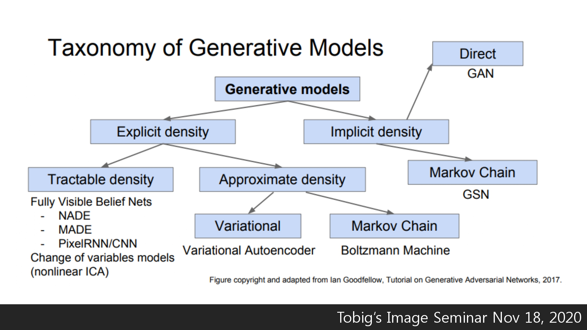

# \[Lecture 13\] Generative Models

안녕하세요, cs231n의 13강 리뷰를 맡은 서아라입니다.

지금부터 13강 Generative models의 리뷰를 진행해보도록 하겠습니다.

저희가 지금까지 공부해왔던 Supervised Learning은 Data가 \(x,y\) 형태로 되어 있으며, x를 y로 Mapping 시켜주는 함수를 찾는 것이 목표입니다.

Supervised Learning에는 Classification, Regression, Object Detection, Semantic Segmentation, Image Captioning등이 있습니다.

