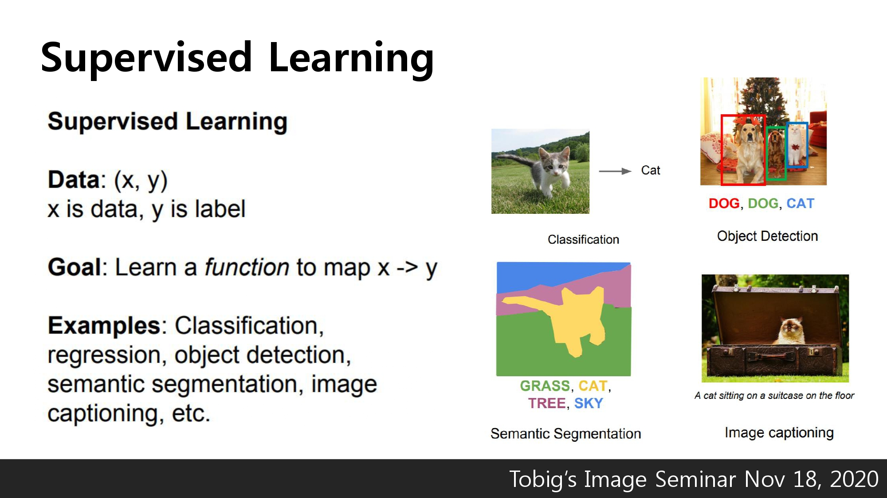

# \[Lecture 13\] Generative Models

안녕하세요, cs231n의 13강 리뷰를 맡은 서아라입니다.

지금부터 13강 Generative models의 리뷰를 진행해보도록 하겠습니다.

저희가 지금까지 공부해왔던 Supervised Learning은 Data가 \(x,y\) 형태로 되어 있으며, x를 y로 Mapping 시켜주는 함수를 찾는 것이 목표입니다.

Supervised Learning에는 Classification, Regression, Object Detection, Semantic Segmentation, Image Captioning등이 있습니다.

생성모델이란 Training Data를 기반으로 학습하여, 동일한 분포에서 새로운 샘플들을 생성하는 것을 이야기합니다.

Generative Models도 Unsupervised Learning에 속합니다.

 Generative Models에서는 Density Etimation을 하는 것이 관건인데,

Density estimation을 하는 방법에는 Explicit Density Estimation\(생성 모델 _**P**_model\(x\)를 명시적으로 나타내어 주는 방법\)과 Implicit Density Estimation\(생성모델 _**P**_model\(x\)를 정의하지 않고 Sample을 얻어내는 방법\)등이 있습니다.

Generative Models의 종류들은 위의 슬라이드에 나와 있듯이 여러 종류가 있습니다.

오늘은 이 중에서도 Pixel RNN/CNN, Variational Autoencoder, GAN에 대하여 설명합니다.

Generative Models를 이용하여 우리는 Sample for artwork, Super-resolution, Colorization, 밑그림 만으로 가방 만들어내기 등의 작업을 할 수 있습니다.

PixelRNN/CNN은 Explicit Density Estimation 중 계산 가능한 density를 다루는 방법 중 하나입니다.

Explicit Density Model을 만들기 위해서

1-d 차원의 Image x의 likelihood를 Chain Rule을 이용하여 decompose합니다.

이때, Pixel Value간 복잡한 분포들은 NN을 이용하여 표현합니다.

따라서 우리는 이를 위해 '픽셀들 간의 순서, 즉 previous pixels'을 정해야 합니다.

여기서 이전 Pixel들을 정의하는데 RNN을 사용하는 방법이 바로 PixelRNN입니다.

PixelRNN은 corner부터 시작하여 이미지 픽셀을 생성하고,

RNN/LSTM을 이용하여 이전 Pixel에 의존합니다.

그러나 sequential generation이기 때문에 생성 속도가 굉장히 느리다는 단점이 있습니다.

위에서 언급한 PixelRNN의 속도측면의 단점을 개선한 것이 바로 PixelCNN입니다.

PixelCNN은 이름에서도 알 수 있듯이 RNN 대신에 CNN을 이용하여 픽셀을 생성하게 됩니다.

PixelCNN도 PixelRNN과 마찬가지로 corner부터 시작하여 이미지 픽셀을 생성합니다.

CNN을 이용하면 Training 이미지의 context region values로 convolution을 병렬화하기 때문에 RNN을 이용했을 때 보다 빠르게 이미지를 생성할 수 있습니다. 

그러나 여전히 sequentially하기 때문에 느린 편에 속하다고 할 수 있습니다.

PixelRNN과 PixelCNN 모두 Training은 Training Image에 대해 Likelihood를 최대로 하도록 training시킵니다.

아래의 슬라이드는 PixelRNN과 PixelCNN의 장점, 단점 등을 요약하여 정리해 놓은 슬라이드입니다.

앞서 살펴본 PixelRNN/PixelCNN같은 경우는 계산할 수 있는 함수로 정의되어 있습니다.

이와 다르게 VAE\(Variational Autoencoders\)는 latent z를 가진 계산이 불가능한 함수로 정의되어 있습니다.

따라서 직접적으로 최적화를 할 수 없기 때문에 likelihood에 대한 lower bound\(하한\)을 유도하여 최적화를 진행해야 합니다.

따라서 Lower bound\(하한선\)를 구해서 계산 가능한 형태로 만들어주어야 합니다.

먼저 VAE의 AE에 해당하는, Autoencoder에 대하여 알아봅시다.

Autoencoder란, 데이터를 압축해서 다시 복원을 해주는데 training data에 대해 복원을 잘 해주는 방식으로 차원 축소를 하기 위해 사용하는 방식을 이야기합니다.

여기서 encoder란 Input data X가 들어왔을 때, 그 특징 벡터 z를 추출하는 과정을 말합니다.

특징 벡터 z는 Input data X보다 차원이 줄어든 형태인데,  Input data에서 noise라고 생각되는 부분은 제거하고 '중요한 특징들'만 담고있는 특징 벡터를 이용하여 z를 구성하고 싶기 때문입니다.

이제 Decoder가 무엇인지 알아봅시다.

Decoder란, 특징 벡터 z를 통해 Input data처럼 재구성하는 과정을 말합니다.

직관적으로는, Decoder는 Encoder의 정반대 과정이라고 생각하시면 좋을 것 같습니다.

Autoencoder은 마지막 과정으로 복원된 이미지와 원본 이미지의 차이를 계산하기 위해서 L2 loss function을 사용합니다.  

Encoder는 Supervised model을 initialize하기 위해 사용할 수 있습니다.

즉 Unsupervised learning을 self-supervised learning 문제로 풀 수 있도록 바꾼 것이 AutoEncoder라고 할 수 있습니다.

VAE\(Variational Autoencoders\)는 AutoEncoder가 추출한 중요한 특징들을 가지고 있는 벡터들을 이용하여 이미지를 재구성할 수는 없을까라는 아이디어에서 나온 방법입니다.

VAE를 이용하여 이미지를 재구성하는 방법은 다음과 같습니다.

우선, 학습데이터가 관측할 수 없는 특징벡터 z로부터 재구성된 것이라고 가정합니다.

생성 모델을 잘 만들기 위해서는 θ∗θ∗의 파라미터 값들을 잘 추정해야 하는데,

여기서 나온 파라미터는 Prior distribution, Conditional distribution 2가지가 있습니다.

Prior distribution의 같은 경우 가우시안 함수로 간단하게 표현하지만,  
Conditional distribution의 같은 복잡한 함수의 경우 Neural Network를 이용하여 표현합니다.

다음으로 VAE model이 어떻게 training을 시키는가에 대하여 알아보도록 하겠습니다.

우선 Pθ를 다음과 같이 정의합니다.

하지만 위의 이미지에서와 같이 정의한 Pθ는 계산이 불가능합니다.

VAE의 encoder와 decoder에 대해서 한 번 알아봅시다.

VAE는 AE\(AutoEncoder\)와 유사한 구조이지만 여기에 확률론적 의미가 추가됩니다.

Encoder와 Decoder에 대한 Network는 다음과 같습니다.

이제 Data likelihood 관점으로 다시 생각해보면, 위와 같은 식을 볼 수 있습니다.

logpθx\(i\)에 대한 식을 log의 성질을 이용하여 3개의 항으로 나눈 것을 알 수 있습니다.

맨 끝에 있는 3번째 항이 문제인데, 그 이유는 3번째 항이 계산 불가능한 항이기 때문입니다.

하지만 KL divergence는 항상 0보다 크거나 같다는 성질에 의해, 이를 이용하여 식을 다시 정리해보면 다음 슬라이드와 같습니다.

따라서 앞의 두 항을 이용하여 Training을 진행합니다.

Training의 과정은 다음 슬라이드에서 살펴볼 수 있습니다.

서로 독립되어 있는 latent variable z를 통해서 다양한 이미지를 생성한 것을 볼 수 있습니다.

하지만 이미지들이 뚜렷하지 않고 blur한 특징을 갖는다는 단점이 있습니다.

VAE는 intractable probability distribution를 이용하여 tractable probability distribution로 근사 시켜 모델을 만듭니다.

하지만 PixelRNN 및 PixelCNN보다는 생성된 이미지가 다소 blur하다는 단점이 있습니다.

GAN은 앞에서 살펴본 방법들과는 달리, 명시적인 밀도함수를 적용하지 않고 단지 Sample을 얻어내는 방법입니다.

GAN은 Generator Network와 Discriminator Network 두 개의 Network로 이루어져 있습니다.

여기서 Generator Network는 실제와 같은 가짜 이미지를 생성하여 Discriminator를 속이는 것이 목적입니다.

Discriminator Network는 실제 이미지와 Generator Network가 만들어낸 가짜 이미지를 구별하는 것이 목적입니다.

GAN의 아이디어를 처음 제시한 이안 굿펠로라는 사람은 그의 논문에서 GAN을 설명하기 위해서 위조지폐범과 이를 가려내기 위해 노력하는 경찰사이의 경합관계가 결국 더 정교한 위조지폐를 만든다는 것을 말하였습니다. \(모두의 딥러닝\(조태호\), p.280\)

경찰과 도둑의 관계로 이해하면 보다 GAN을 이해하는데 더 도움이 되지 않을까 싶습니다.

GAN에 대하여 도식으로 정리해보면 다음과 같습니다.

다음 슬라이드는 GAN의 objective function에 대하여 알려줍니다.

Discriminator는 objective를 최대화\(가짜는 가짜로 구별해야 하므로\)하려 하고,

Generator는 objective를 최소화\(가짜를 진짜처럼 만들기 위해\)하려 합니다.

위의 슬라이드는 GAN의 training algorithm을 나타낸 슬라이드입니다.

Training 후 Test를 할 때는 Generator Network를 이용하여 새 이미지를 생성합니다.

위의 슬라이드는 GAN이 CIFAR-10 data를 이용하여 학습한 후, 생성한 이미지를 볼 수 있습니다.

처음 GAN이 제안된 후, GAN에 대한 연구는 정말 활발하게 이루어져 왔습니다.

cs231n 에서는 그 중 DCGAN을 소개하는데, DCGAN은 CNN과 GAN을 결합한 방법입니다.

위의 슬라이드는 DCGAN의 Architecture에 대하여 설명하고 있습니다.

DCGAN을 이용하여 생성한 이미지들을 위의 슬라이드에서 살펴볼 수 있습니다. 

정말로 실제로 존재하는 공간을 사진으로 찍은 것처럼 사실과 매우 흡사합니다.

또한 DCGAN에서는 그동안 NLP분야에서의 Word2Vec과 같이 벡터간의 연산이 가능하게 할 수 있었다고 합니다.

백터들간의 연산을 수행하여 위와 같이 새로운 이미지를 만들어낼 수 있다는 것입니다.

마지막으로 오늘 배운 생성보델들에 대한 정리를 한 요약 슬라이드입니다.

처음 접하면 다소 어려운 내용들이지만, 한국어 자막도 무료로 배포되고 있으며 차근차근 동영상을 멈추며 인터넷 서칭을 통해서 공부를 하다보면 모두 소화할 수 있을 것이라고 생각합니다.

감사합니다.



