# \[Lecture 7\] Training Neural Networks II

## CS231n 7강 리뷰

부제: 옵티마이저 정복기

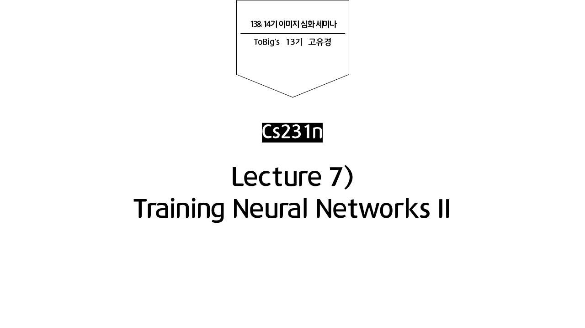

   6강에 이어 이번 강의에서는 **Optimization\(최적화\), Regularization\(규제화\), Transfer Learning\(전이 학습\)**을 다룬다. CNN이라기보다 전반적인 뉴럴넷에 관한 내용이기 때문에, 이미지 뿐만 아니라 딥러닝을 공부하는데 매우 중요한 파트라 할 수 있다.

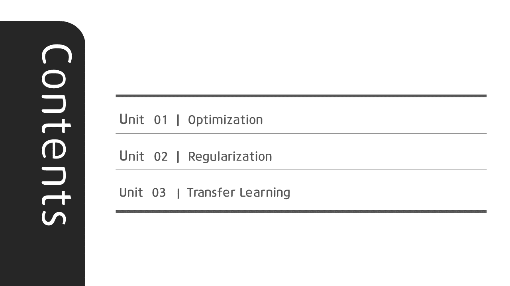

## 1. Optimization

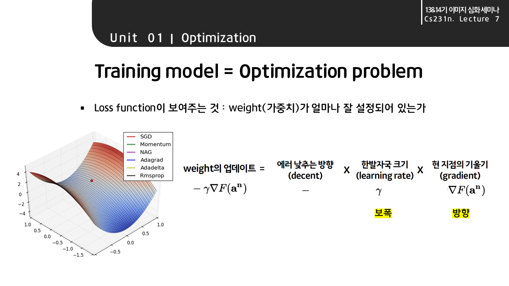

   딥러닝에서 **모델을 학습**시킨다는건 **최적화\(optimization\)** 태스크를 수행하는 것과 같다. 여기서 최적화란, 좌측 그래프처럼 정의된 **손실 함수\(loss funciton\)의 최솟값을 찾아나가는 일련의 과정**을 말한다. 최적화는 **역전파\(Backpropagation\) 과정 중에 가중치를 업데이트하면서 진행**되는데, 이 때

* **한 스텝마다 이동하는 발자국의 크기**, 즉 **보폭**이 **학습률\(learning rate\)**로 정의되고,
* **앞으로 이동할 방향**은 **현 지점의 기울기\(gradient\)**를 통해 정의된다.

매 스텝마다 순전파\(forward pass\)의 끝단에서 계산되는 손실 함수값은 지금까지 업데이트된 가중치들이 얼마나 잘 설정되어 있는지를 나타내는 지표와도 같다.

  

### 1.1. SGD

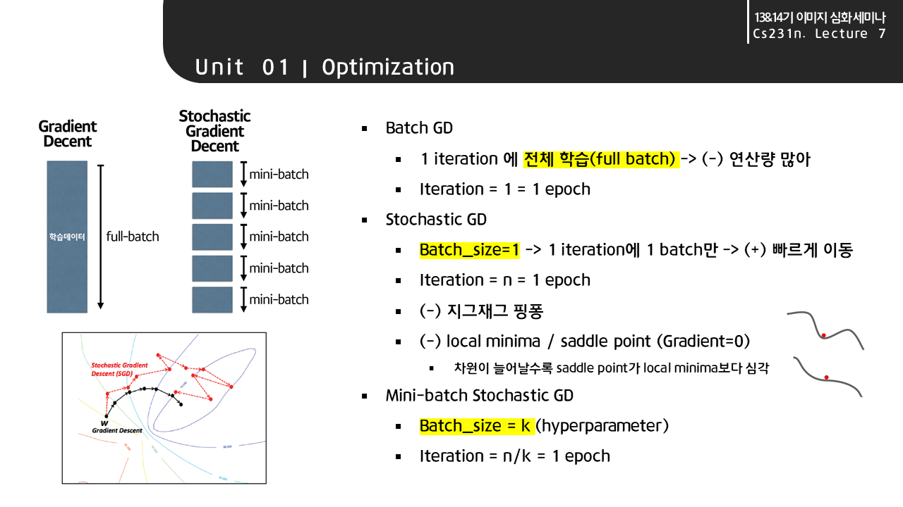

   손실함수의 최소값을 찾아나가는 과정은 기본적으로 손실 함수를 차근차근 밟아 내려가는 Gradient Descent 알고리즘으로 정의된다. **Batch Gradient Descent**는 **한 번 학습할 때 모든 학습데이터를 가지고 연산**을 진행하고, 이에 따라 **연산량이 많아 학습 속도가 느린 단점**이 있다.

이에 반하여 등장한 **Stochastic Gradient Descent** \(이하, SGD\)는 한 번에 **전체 학습데이터에서 하나씩 랜덤으로 뽑아** 학습을 진행한다. 이와 비슷한 **Mini-batch Stochastic GD**도 있는데, 이 경우 **하이퍼파라미터로 정의된 batch\_size\(k개\) 만큼의 데이터를 랜덤으로 뽑아** 한 회 학습에 이용한다. SGD와 Mini-batch SGD는 둘 다 **학습이 빠르게 이뤄진다는 장점**이 있지만, 좌측 하단 그림의 빨간 선처럼 **지그재그로 핑퐁하면서 불안정한 학습과정**을 보인다. 또한, 우측 2개의 그래프처럼 **local minima\(지역 최소점\)과 saddle point\(안장점\)에 빠질 수 있다는 치명적인 단점**이 있다.

이러한 SGD의 문제점을 해결하기 위해 여러 개의 **옵티마이저\(optimizer\)**들이 차례로 등장하게 된다.

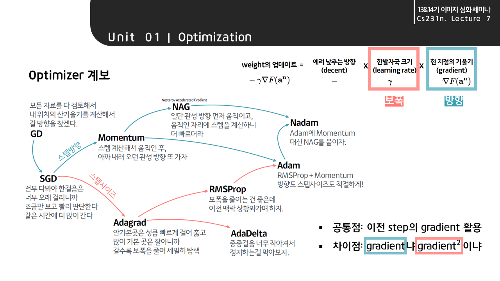

   상당히 많고 어려우며, 딥러닝을 처음 공부할 때 주춤하게 되는 지점이 바로 이 옵티마이저 파트이다. 개인적 경험상 여러번 반복해서 공부하였고, 어느 정도 이해하는데에 꽤나 긴 시간이 소요되었다.

따라서 이 글을 보시는 여러분들에게 추천하는 방법은 하나하나 뜯어서 살펴보되, 어느 정도 이해한 후에는 **한 눈에 정리해서 옵티마이저 별 논점만 기억**하는 것이다. 위 장표의 옵티마이저 계보는 [하용호님의 슬라이드](https://www.slideshare.net/yongho/ss-79607172/)에서 발췌했다. \(본문 하단 references에도 언급해두었지만, 딥러닝을 공부하면서 만나봤을 개념들을 깔끔하게 정리해준 자료로 시간내서 한 번 읽어보시길 강력 추천한다!\)

옵티마이저들은

* **보폭을 중심으로 하느냐\(분홍색\)**
* **방향을 중심으로 하느냐\(파란색\)**

에 따라 크게 **두 가지 갈래**로 나뉜다. 여기서 유의할 점은 **두 갈래 모두 이전 step의 gradient**를 활용하는데,

* **방향**을 중심으로 하는 옵티마이저들은 **gradient**를,
* **보폭**을 중심으로 하는 옵티마이저들은 **graident의 제곱**을

연산에 활용한다.

먼저 파란 갈래, 즉 **방향을 중심으로 하는 옵티마이저**부터 살펴보자.

### 1.2. SGD + Momentum

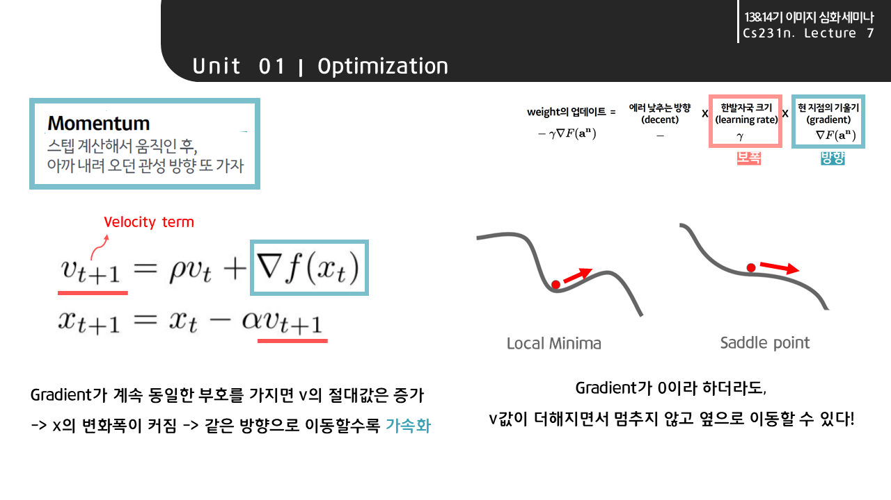

  Momentum은 기존 **SGD에서 velocity term이 추가**된 버전이다. 이름에서도 알 수 있듯이, 이 velocity term은 **속도를 조절하는 역할**을 맡아 **관성\(momentum\)** 효과를 낸다.

식을 살펴보았을때, 매 스텝마다 **gradient가 동일한 부호**를 가지면 **v의 절댓값은 계속 증가**할 수 밖에 없다. v가 증가함에 따라 **x의 변화폭이 커지고**, 이는 즉 **같은 방향으로 이동할수록 더 많이 이동하게 하여 가속화**한다는 말과 같다.

이러한 특징 덕분에 위에서 SGD의 한계점으로 언급되었던 **local minima**나 **saddle point**에서 gradient가 0에 수렴하는 값을 가진다 하더라도 **이전 step들에서 축적되어온 v값이 더해지며 멈추지 않고 옆으로 탈출**할 수 있게 되는 것이다..!

### 1.3. Nesterov Momentum

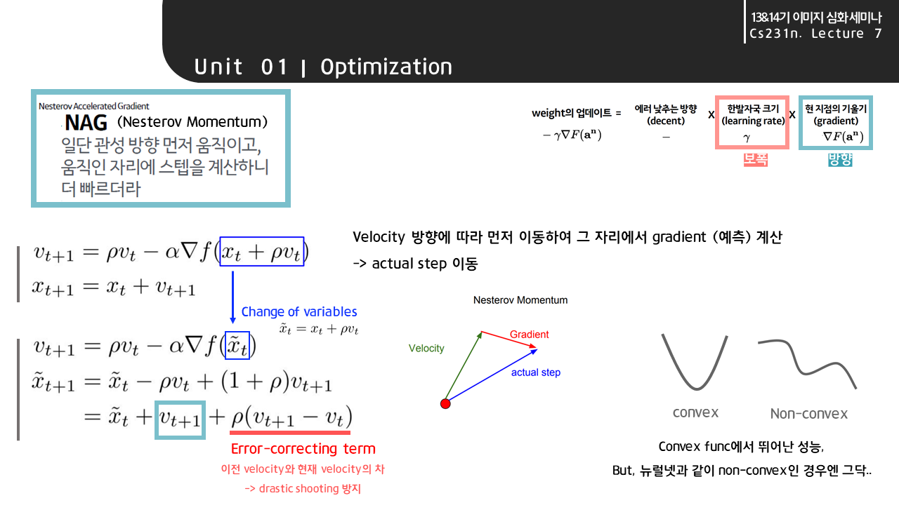

  이어서 등장한 NAG은 momentum과 비슷하지만 살짝 다르다. **이전 스텝의 velocity 방향을 따라 먼저 이동**하여\(실제로 이동하는 것은 아니다!\) **그 자리에서 gradient를 계산**하고 **다시 본래 자리로 돌아와 actual step을 이동**한다.

**gradient를 계산하는 지점과 실제 이동하는 지점이 다르다**는 이야기인데, '왜 굳이..?' 라는 생각이 들 수 있다.

이렇게 되면 새롭게 변화되는 식에서 **error-correcting term**이라는 것이 생기는데 이는 **이전 velocity와 현재 velocity의 차이를 반영**하여 **급격한 슈팅을 방지**한다는 측면에서 효과가 있고 더 빠른 학습을 가능하게 한다고 한다.

다음으로 **분홍 갈래, 즉 보폭을 중심으로 하는 옵티마이저**를 살펴보자.

### 1.4. AdaGrad

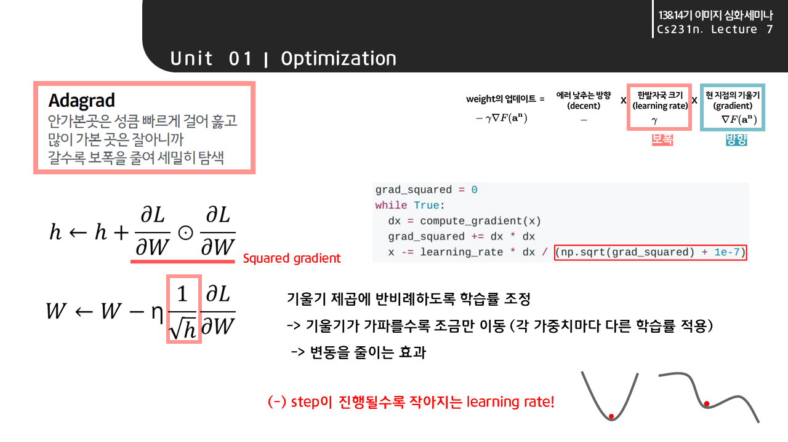

위에서도 언급했듯이 **보폭**을 중심으로 하는 옵티마이저들은 **기울기의 제곱**을 연산에 활용한다. Adagrad의 경우 **squared gradient\(기울기 제곱\)에 반비례하도록** 학습률을 조정하는데, 이는 **기울기가 가파를수록 조금만 이동**하고, **완만할 수록 조금 더 이동하게 함**으로써 **변동을 줄이는** 효과가 있다. 무엇보다 **행렬곱 연산**을 통해 **가중치마다 다른 학습률을 적용**한다는 점에서 더욱 정교한 최적화가 가능해진다.

그런데 **문제**가 있다.

* 아무리 좋은 값이라 하더라도 결국 학습이 진행될 수록 $$h$$는 **축적**된다.
* $$h$$ 의 값이 커질 수록 이와 반비례하여 **이동하는 보폭은 줄어들게** 된다.

그럼 결국엔 어떻게 될까?

**기울기가 0인 부근에서 학습이 급격하게 느려져** SGD의 문제로 언급되었던 **local minima**와 **saddle point**에 빠지게 될 위험이 커진다. 이 문제를 해결하고자 아래 **RMSProp**이 등장하게 된다.

### 1.5. RMSProp

  RMSProp의 식은 위 Adagrad 식과 크게 다르지 않다.

**핵심**은! **보폭을 갈수록 줄이되, 이전 기울기 변화의 맥락을 살피자**는 것이다.

Adagrad식의 $$h$$와 squared gradient에 각각 $$p$$, $$(1-p)$$의 **decay rate**가 붙는다. 보통 $$p=0.9$$정도로 설정되는데, 이렇게 되면 **이전 스텝의 기울기를 더 크게 반영**하여 $$h$$**값이 단순 누적되는 것을 방지**할 수 있다. 이 과정을 있어보이는 말로 **"지수 가중 이동 평균"**이라고 한다. 무작정 보폭을 줄이지 않도록 옆에서 말리는\(?\) 역할이라고 이해해도 좋을 듯 하다.

### 1.6. Adam

   대망의 아담이다. 앞서 등장한 **두 갈래의 옵티마이저들의 집합체**이며, 가장 흔하게 이용되는 옵티마이저이다.

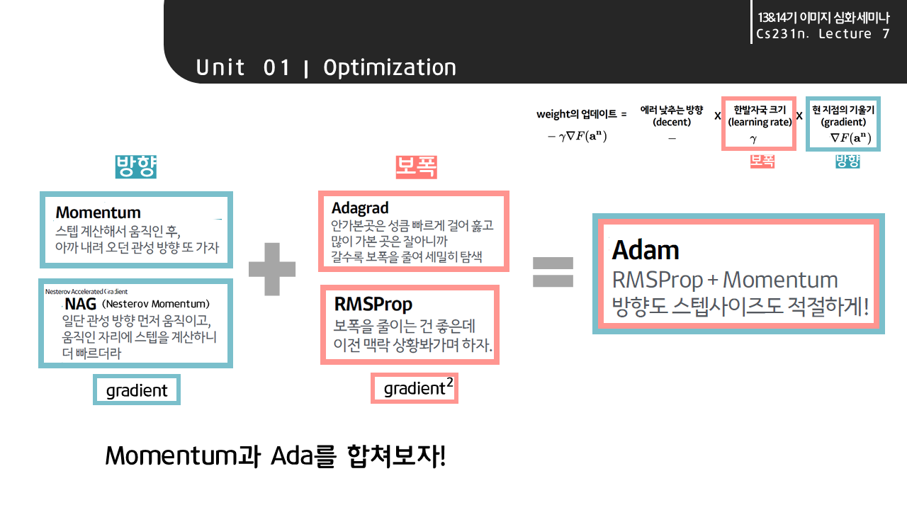

**방향**을 중심으로 한 **Momentum** 계열과 **보폭**을 중심으로 한 **Ada**계열이 합쳐져, **보폭도, 방향도 적절하게 조절**하는 최강보스 옵티마이저가 등장하였다!

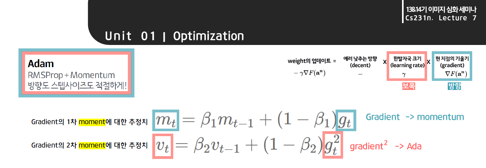

   또 나와버린 새로운 식에 당황하지말고 우리가 아는 것부터 천천히 찾아보자.

> 1. $$m_t$$의 식에서 파란색 박스 속 $$g_t$$를 보니 이 친구는 **gradient를 중심으로 하는 모멘텀** 계열이겠구나!
> 2.  그 아래 분홍색 박스 속 $$g_t^2$$를 보니 $$v_t$$는 **gradient 제곱에 반비례하는 ada, rmsprop** 계열이겠구나!
> 3. $$m_t$$와 $$v_t$$모두 rmsprop 슬라이드에서 봤던 **decay rate가 포함된 가중평균식과 비슷**하네!

   이 정도만 파악했어도 절반은 온 것이다. 이제 다음 단계로 넘어가보자.

   슬라이드 왼쪽을 보면 **Gradient의 1차, 2차  moment에 대한 추정치**라는 알 수 없는 말이 나온다. 여기서 **moment**는 수리통계학을 공부한 사람이라면 단번에 알아볼 법한 **적률** 개념이다. 

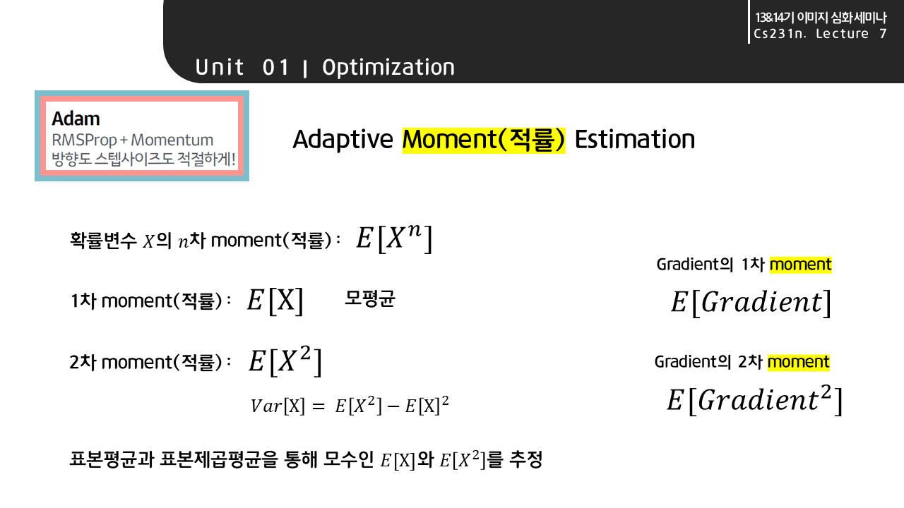

   적률이 생소하신 분들을 위해 moment가 가리키는 것이 무엇인지만 간단히 짚고 넘어가고자 한다.

기본적으로 통계학에서 **n차 moment\(적률\)**이라고 하면 $$X^n$$**의 기댓값**을 의미한다. 우리가 흔히 알고 있는 **모평균**은 원래 $$X$$의 **1차 적률**이었던 것이다. 마찬가지로 분산을 구할때 자주 등장하는 $$E(X^2)$$ 역시 $$X$$의 **2차 적률**이라고 불리는 친구였다. 우리는 표본평균과 표본제곱평균을 통해 **모수**에 해당하는 이 **1차 적률, 2차 적률을 추정**하는 것이다.

이제 이 개념을 그대로 옆으로 들고 오자.

이전 슬라이드에서 나왔던 **Gradient의 1차, 2차 moment에 대한 추정치**는 각각 **모수**인 $$E(Gradient)$$와 $$E(Gradient^2)$$를 **추정**하는 값을 가리키는 말인 것이다.

적률이라는 용어에 대해 조금은 감이 오셨길 바란다.

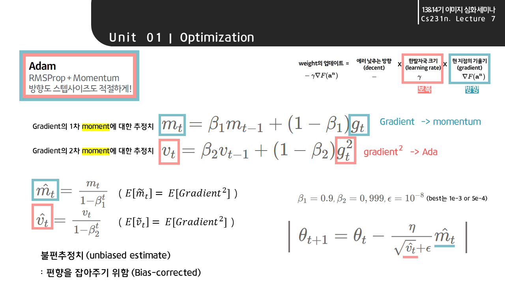

**자 그럼 이렇게 구해진 추정치** $$m$$**과** $$v$$**가 가중치 업데이트 식에 바로 쓰이느냐?**

그건 또 아니다. 아직 **한 단계**가 더 남아있다.

통계학에서 **"불편추정치"** 라는 개념이 존재하는데 이는 편향\(bias\)이 0인 추정치를 뜻한다. 무슨 말인지 받아들이기 어렵다면 **우리가 구하는 추정치들 중에 가장 좋은 친구가 불편추정치**라고만 생각해두자.

이제 다시 한 번 슬라이드 위쪽 **파란**색 식 $$m_t =\beta_1 m_{t-1} + (1-\beta_1)g_t$$을 살펴보자.

> 여기서 만약 $$m$$**의 초기값\(즉,** $$m_{t-1}$$**\)이 0이면**, 그와 곱해지는 $$\beta_1$$이 1에 가까운 값\(0.9\)으로 지정되어있기 때문에 기울기인 $$g_t$$의 값에 관계없이 $$(1-\beta_2)g_t$$는 0에 가까운 값이 되어 **결국** $$m_t$$**가 0에 가까워진다**. 이 $$m_t$$가 그대로 아래 가중치 업데이트 식에 쓰이면 $$\theta_{t+1} = \theta_t - \frac{\eta}{\sqrt{\hat{v_t}}+\epsilon}\hat{m_t}$$에서 **기울기에 비례하는 momentum 계열**의 특성이라고 할 수 있는 $$m_t$$**부분의 값이 0에 가까워져 한 step에 이동을 거의 하지 못하는\(가중치가 업데이트되지 못하는\) 편향된 결과**를 보일 수 있다. 따라서, 이러한 편향을 잡아주기 위해 $$m_t$$ **대신 불편추정치를 계산하여** $$\hat{m_t}$$**으로** 가중치 업데이트 식에 적용하는 것이다.

이렇게 **momentum 계열**의 특성을 반영했다면 이번엔 **ada 계열**의 특성을 반영할 차례이다.

슬라이드 위쪽 **분홍**색 식 $$v_t =\beta_2 v_{t-1} + (1-\beta_2)g_t^2$$을 살펴보자.

> 여기서 만약 $$v$$**의 초기값\(즉,** $$v_{t-1}$$**\)이 0이면**, 그와 곱해지는 $$\beta_2$$가 1에 가까운 값\(0.999\)으로 지정되어있기 때문에 기울기 제곱인 $$g_t^2$$ 의 값에 관계없이 $$(1-\beta_2)g_t^2$$ 는 0에 가까운 값이 되어 **결국** $$v_t$$**가 0에 가까워진다**. 이 $$v_t$$가 그대로 아래 가중치 업데이트 식에 쓰이면 $$\theta_{t+1} = \theta_t - \frac{\eta}{\sqrt{\hat{v_t}}+\epsilon}\hat{m_t}$$에서 **기울기 제곱에 반비례하는 ada 계열**의 특성이라고 할 수 있는 $$\frac{1}{\sqrt{v_t}}$$ **부분의 값이 발산하게 되어 한 step에 너무 많이 이동해버리는 편향된 결과**를 보일 수 있다. 따라서 이러한 편향을 잡아주기 위해 $$v_t$$ **대신 불편추정치를 계산하여** $$\hat{v_t}$$ **으로** 가중치 업데이트 식에 적용하는 것이다.

이제 왜 Adam이 앞서 등장한 momentum과 ada, 두 갈래의 옵티마이저들의 집합체라 불리었는지 알 수 있을 것이다. 방향을 중심으로 한 Momentum 계열과 보폭을 중심으로 한 Ada계열이 합쳐져, **보폭도, 방향도 적절하게 조절**할 수 있게 된다.

혹시라도 잘 이해가 가지 않았다면, 옵티마이저 계보에 따라 두 갈래로 나누어 다시 한 번 수식을 차례로 살펴보자. Adam까지 이어지는 여러 옵티마이저들의 흐름을 하나로 연결할 수 있을 것이다.

### 1.7. 그 외

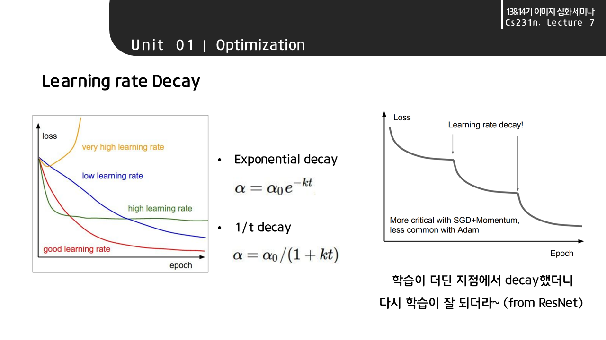

  옵티마이저 외에도 **학습률\(Learning rate\)을 조정**하는 방법들이 존재한다. 기존 학습률 $$\alpha_0$$에서 $$e^{-kt}$$를 곱하여 step이 지날 수록 학습률을 줄여나가는 **Exponential decay** 기법이 있고, $$(1+kt)$$ 를 나누어 학습률을 조정하는 방법도 있다.

오른쪽 그래프는 "ResNet에서 학습이 진행되면서 속도가 더딘 지점에서 학습률을 작게 조정했더니 다시 학습이 잘 되는 양상을 보이더라~"는 요지이다. 중요한 점은 **Learning rate Decay를 처음부터 쓰는 것이 아니라 학습과정을 모니터링한 후에 학습이 더딘 지점 등 필요하다고 판단되는 시점에 써야한다**는 것이다.

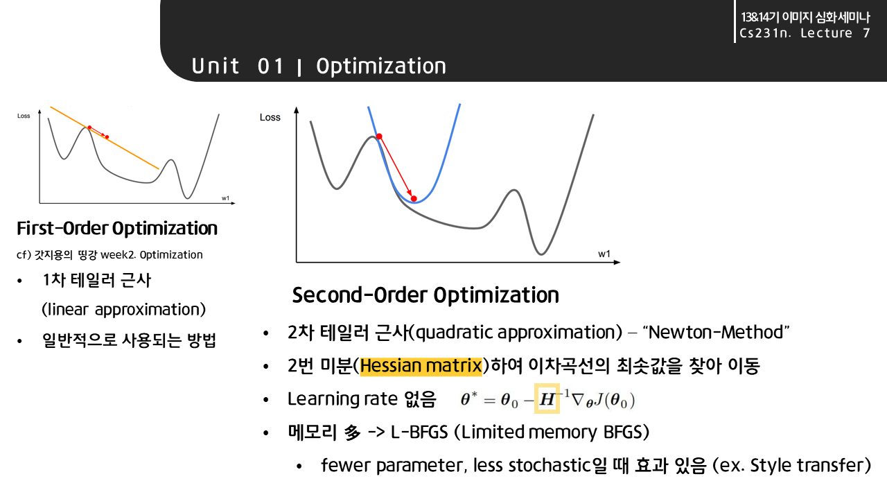

일반적으로 우리는 최적화 과정에서 한 스텝씩 이동할때마다 gradient를 계산할때 **1차 테일러 근사** 기법\(흔히 아는 직선의 기울기 구하는 방식\)을 활용하며, 이를 **First-Order Optimization**이라고 한다.

이외에도 Newton-Method인 **2차 테일러 근사법**에 기반한 **Second-Order Optimization**이 있는데, 여기서는 일반적인 경사하강법과 다르게 2번 미분하여 **이차곡선의 최솟값을 찾아 다이렉트로 이동**한다는 특징이 있다. 따라서 Learning rate라 불리우는 **학습률이 없고**, 대신 2번 미분한 값들이 모여있는 **Hessian Matrix**를 통해 연산이 진행된다. 행렬 연산으로 인해 **메모리를 많이 잡아먹는다**는 문제점이 있고 이에 따라 필요한 메모리를 줄여주는 **L-BFGS**\(Limited memory BFGS\) 기법이 등장하기도 하였다. 일반적으로 style transfer와 같이 **파라미터 수가 적고 임의성이 덜 할 때** 효과가 있다고 한다.

## 2. Regularization

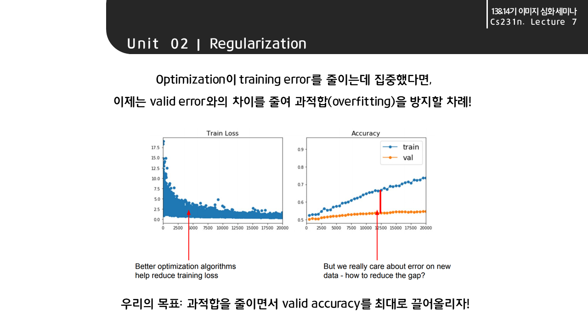

최적화\(Optimization\) 과정이 손실함수의 최솟값을 찾아나가며 **train error를 줄이는데** 집중했다면 이제는 **valid error와의 차이를 줄여 과적합을 방지**할 차례이다. 알다시피 **과적합은 딥러닝의 고질병이자 고질병이자 고질병**이다..! 과적합을 줄이면서 valid acc를 높이기 위해 우리는 적절한 규제기법들을 학습에 도입한다.

### 2.0. Model Ensembles


Model Ensemble은 규제화 기법이 아니다!


정확하게 말해서 모델 앙상블은 규제 기법이 아니다. 하지만 최적의 test 결과를 내기 위한 방안이기 때문에 규제 기법들과 함께 소개하고자 한다.

머신러닝에서의 앙상블처럼 **여러 모델을 독립적으로 학습하여 test 결과를 평균**내는 것이다. 또 다른 방식으로는 모델 하나의 학습과정에서 여러번 캡쳐하듯 스냅샷을 찍어 **학습률이 크게 변동할 때 이를 완화**해주는 효과를 노리기도 한다.

이제 단일 모델에서 과적합을 방지하기 위한 규제기법들을 살펴보자.

### 2.1. L1&L2 Regularization

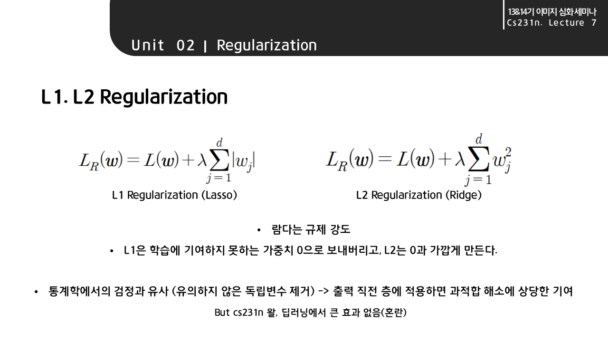

L1,L2 Regularization은 **통계학의 가설검정과 유사**하다.

가설검정 시 **t값이나 F값, 혹은 p-value를 통해 유의미한 변수인지 아닌지를 판단**하는 것처럼 regularization은 **loss를 줄이는데 기여하지 못하는 모수를 0\(L1\) 또는 0에 가까운\(L2\) 값으로 제한**하는 기능을 한다.

보통 L2 regularization이 L1보다 더 많이 쓰이고, **출력 직전 층**에 적용하면 과적합 해소에 상당한 기여를 한다. 본 강의에서는 L1,L2가 딥러닝에서는 큰 효과가 없다고 언급했지만, 개인적으로 학교 강의와 실습을 통해 효과를 본 기법이라 사용해보는 것을 추천한다.

### 2.2. Dropout

   다음으로 아주 유명하고 그만큼 자주 쓰이는 dropout 기법이다. 슬라이드를 절반으로 나누어 설명하겠다.

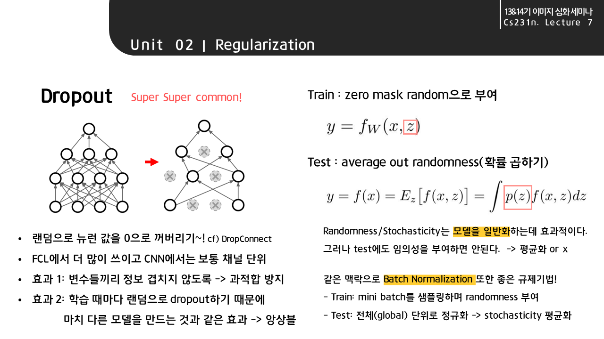



  Dropout이란 **랜덤으로 뉴런 값을 0으로 보내버리는** 것이다. 비슷한 개념으로 DropConnect는 가중치를 0으로 만든다. **Fully Connected Layer**에서 더 많이 쓰이며 **CNN**에서는 보통 **채널 단위**로 적용된다. 왜 소중한 뉴런들을 0으로 꺼버리느냐? 우선 모델이 학습을 하다 보면 **비슷한 정보를 가지는 노드**가 생기기 마련이다. 이는 **과적합을 야기**할 수 있기 때문에 **입력값의 일부를 0으로** 두어 역전파시 파라미터 업데이트가 되지 않고, 이는 **모형의 불확실성을 증가**시켜 **과적합 해결에 기여**하게 된다. 또한, 학습 때마다 **랜덤**으로 dropout하기 때문에 **마치 다른 모델을 만드는 것과 같은 앙상블 효과**를 내기도 한다.



   dropout을 train data로 모델을 학습시킬 때만 활용하고 test data를 적용할때는 사용하지 않는 것으로만 알고 있는 사람들이 많을 것이다. **test 단계에서 dropout이 아예 쓰이지 않는 것은 아니다.** 여기서 정확히 짚고 가자. 우선 학습시에 **zero mask를 랜덤**으로 부여한다. 반면, **test** 단계에도 train 단계처럼 **임의성을 부여하기 안되기 때문에** 위 식처럼 **확률값을 곱하여 기댓값을 구해 평균화**하거나 혹은 그냥 사용하기도 한다. 이와 같은 맥락으로 **BN\(배치정규화\)**도 좋은 규제 기법이라할 수 있는데 그 이유는, **train**에서 **mini batch를 샘플링하며 임의성을 부여**하고 **test**에서는 **전체 단위로 정규화하여 평균화**하는 효과를 내기 때문이다.



이제 **규제기법들의 패턴**이 어느 정도 보일 것이다. 패턴을 정리하기 전에 한 가지 방법을 더 살펴보도록 하자.

### 2.3. Data Augmentation

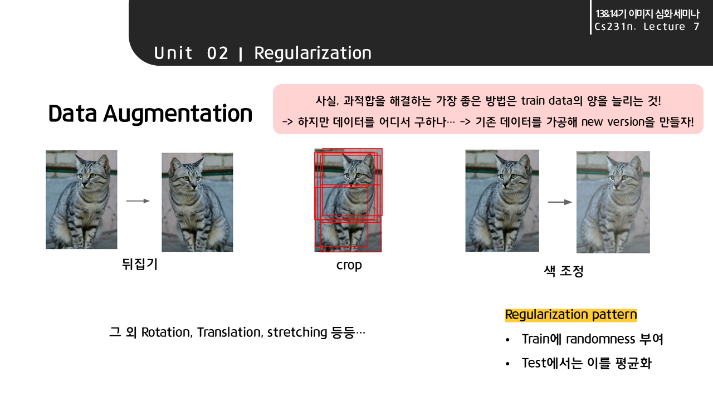

 

사실.. 제 아무리 규제 기법을 쓴다 한들 **학습데이터를 늘리는 것 만큼 과적합 해결에 효과적 방법**은 또 없다. 모델의 일반화\(generalization\)를 용이하게 하기 위해서는 절대적인 train data 수가 많아야 하기 때문이다.

하지만 우리가 데이터를 늘리고 싶다고 해서 늘릴 수는 없지 않은가.

그럼에도 불구하고, 똑똑한 사람들은 방법을 만들어냈다. 바로 **기존 데이터를 가공해서 새로운 버전을 만드는** 것이다. 위 슬라이드의 예시처럼 고양이 사진을 **뒤집거나, 자르거나, 색을 조정**하여 새로운 학습데이터를 만들어낸다. 데이터가 늘어나면 학습시에 임의성이 부여되기 때문에 모델의 일반화에 용이하다. &lt;/br&gt;

> 지금까지 살펴보았던 규제 기법들은 **일정한 패턴**을 가지고 있다. 
>
> 1. **train** 단계에서는 모델에 **randomness, 즉 임의성**을 부여한다.
>
> 2. **test** 단계에서는 이를 **평균화**하여 **균일하게 학습효과가 적용**되도록 한다.

### 2.4. 그 외

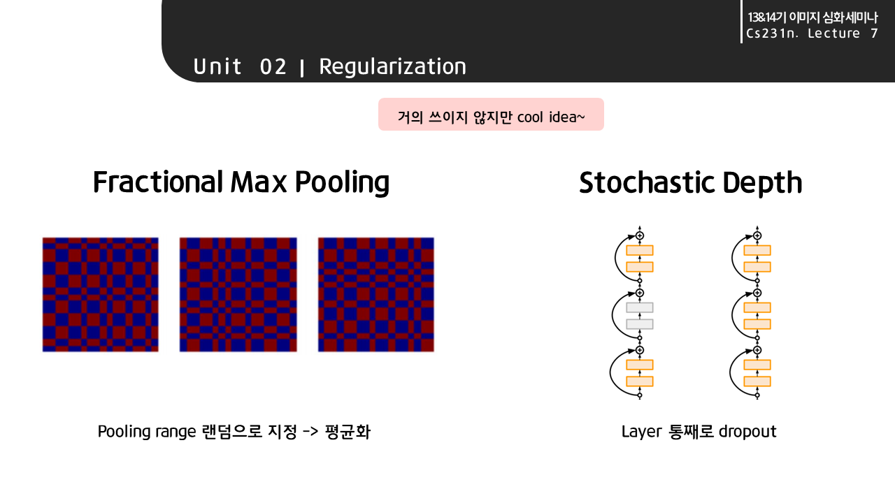

거의 활용되지는 않지만 강의에서 Cool Idea로 소개된 2가지 방법도 있다.

우선 **Fractional Max Pooling**은 **CNN**에서 **pooling range**가 차례로 훑는 식으로 정해지는 것이 아닌 **랜덤**으로 지정되어 **평균화** 효과를 도모한다.

다음으로는 **Stochastic Depth**라 하여, 노드나 가중치를 0으로 보내는 것이 아닌 **layer를 통째로 dropout**하는 기법이다.

## 3. Transfer Learning

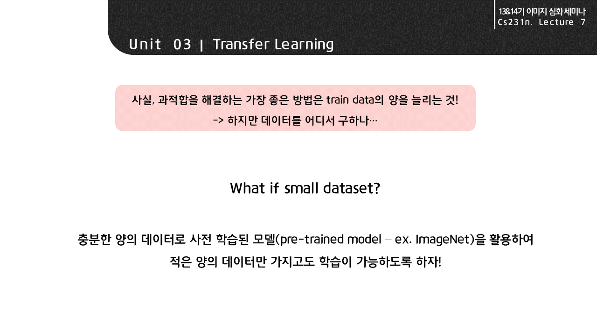

  위에서 과적합 해결을 위해 가장 좋은 방법은 데이터의 양을 늘리는 것이라 하였다. 하지만 데이터를 어디서 구하며.. 만약 우리가 가지고 있는 데이터가 **모델을 학습시키기에 턱없이 부족한 양**이라면 어떻게 해야할까?

방법이 있다. 바로 **충분한 양의 데이터로 이미 학습된 모델**을 활용하여 우리의 데이터셋을 학습시키는 것이다. 이를 **전이학습\(Transfer Learning\)**이라고 한다.

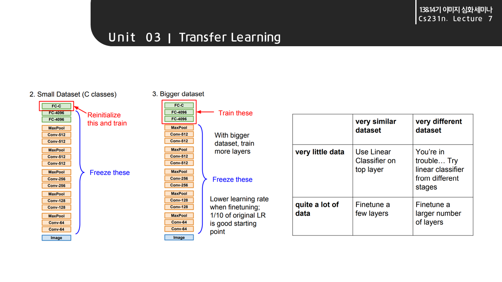

만약 학습에 쓰일 데이터셋이 **아주 적은** 양이라면, 마지막 FCL\(fully connected layer\)을 제외하고 모든 층의 **가중치를 고정**시켜 학습시킨다.

조금 더 큰 데이터셋이라면 **가중치를 학습시킬 층을 늘리면** 된다. 오른쪽 2x2 table은 우리의 데이터와 사전학습모델 데이터의 상황에 따라 생각해볼 수 있는 방법들을 알려주고 있다.

사전학습모델을 **미세조정\(fine-tuning\)**하는 전이학습은 **실제 프로젝트**에서도 많이 쓰이는 방법이니 잘 기억해두도록 하자!

## References

* Stanford cs231n 7강

  [http://cs231n.stanford.edu/syllabus.html](http://cs231n.stanford.edu/syllabus.html)

  [https://www.youtube.com/watch?v=\_JB0AO7QxSA&t=2149s](https://www.youtube.com/watch?v=_JB0AO7QxSA&t=2149s)

* \[딥러닝\]딥러닝 최적화 알고리즘 알고 쓰자. 딥러닝 옵티마이저\(optimizer\) 총정리[https://hiddenbeginner.github.io/deeplearning/2019/09/22/optimization\_algorithms\_in\_deep\_learning.html](https://hiddenbeginner.github.io/deeplearning/2019/09/22/optimization_algorithms_in_deep_learning.html)
* 딥러닝\(Deep learning\) 살펴보기 2탄

  [https://seamless.tistory.com/38](https://seamless.tistory.com/38)

* 자습해도 모르겠던 딥러닝, 머리속에 인스톨 시켜드립니다. _\(개인적으로 강추!!!하는 자료\)_

  [https://www.slideshare.net/yongho/ss-79607172](https://www.slideshare.net/yongho/ss-79607172)

* cs231n 2017 강의 7강 training neural networks part2 정리

  [https://lsjsj92.tistory.com/405](https://lsjsj92.tistory.com/405)

