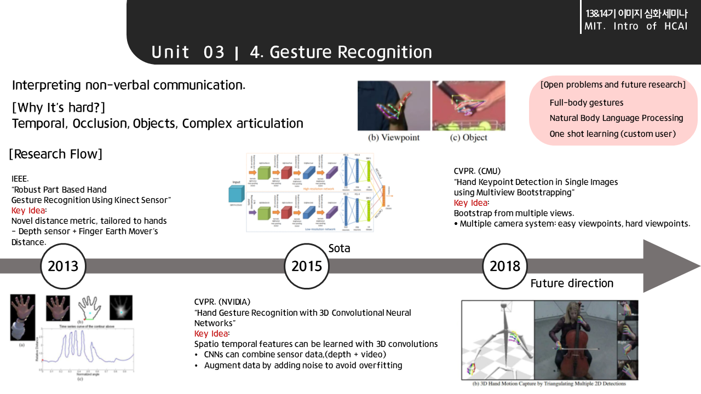

# \[MIT\] Introduction to Human-Centered Artificial Intelligence \(AI\)

#### [Lecture Video](https://www.youtube.com/watch?v=bmjamLZ3v8A)

#### 

이번 주차는 특별 시간으로 MIT 컴퓨터공학과 Lex Fridman 교수의 인간중심 AI 개론 강의를 리뷰하고자 다.

## 1. Human-Centered AI

AI는 

## 2. 5 Grand Challenges of HCAI

### 1. HCAI during Learning Phase

### 2. HCAI during Real-World Operation

## 3. Deep Learning for Understanding Human

### 1. Face Recognition

### 2. Activity Recognition

### 3. Body Pose Estimation

### 4. Gesture Recognition

